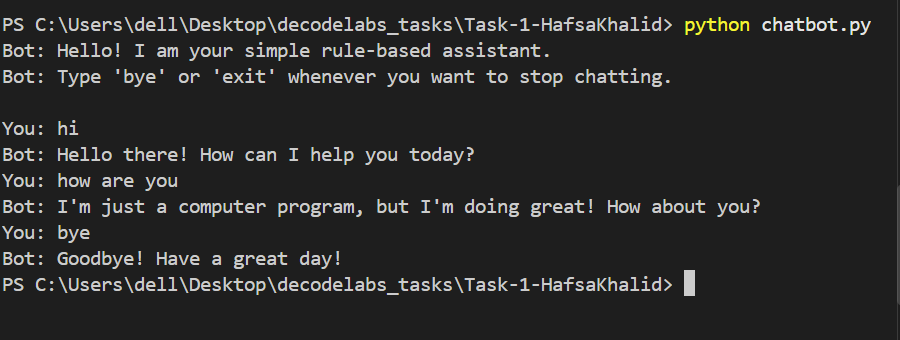

# Rule-Based AI Chatbot

A simple, interactive rule-based chatbot implemented in Python that responds to predefined user inputs using conditional logic and continuous control flow.

## What It Does
- Keeps a continuous chat session open until you tell it to exit.
- Cleans and normalizes user inputs (stripping extra spaces and converting text to lowercase).
- Matches common phrases like greetings, names, and general questions using standard Python conditions.
- Responds with a default message when it encounters an unrecognized input.

## File Overview
- `chatbot.py`: Main script containing the chat loop and conditional logic.
- `README.md`: Project documentation.
- `.gitignore`: Prevents temporary or local system files from being tracked by Git.

## How to Run

1. Make sure Python 3.x is installed on your computer.
2. Run the script directly from your terminal:
   ```bash
   python chatbot.py
   ```
## Supported Commands
- **Greetings:** `hello`, `hi`, `hey`
- **Questions:** `how are you`, `your name`, `help`
- **Exit Commands:** `bye`, `exit`, `quit`
## Execution Demo


