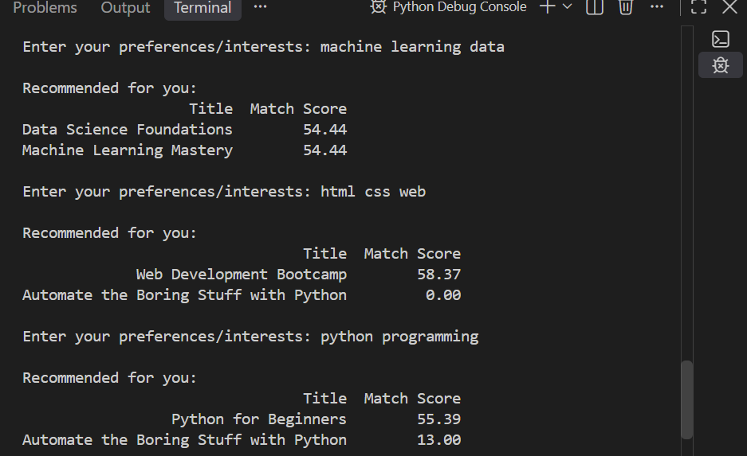

# Task 3: Content-Based Recommendation System

[](https://www.python.org/)
[](https://scikit-learn.org/)
[](https://pandas.pydata.org/)

An interactive Python-based recommendation system that matches user preference keywords with educational courses/products using TF-IDF vectorization and Cosine Similarity.

---

##  Project Features
- **User Preference Matching:** Processes free-text user interests and keywords.
- **TF-IDF & Cosine Similarity:** Computes text similarity scores to rank relevance accurately.
- **Interactive CLI Loop:** Continuous command-line interface with `exit` command functionality.
- **Automated Verification:** Includes modular unit tests for core recommendation output.

---

##  Requirements & Setup

1. **Clone or Navigate to Directory:**
   ```bash
   cd Task-3-HafsaKhalid
   ```
##  Install Dependencies:

```bash
pip install -r requirements.txt
```
## Run the Recommendation System:

```bash
python recommendation_system.py
```
## Run Unit Tests:

```bash
python test_recommendation.py
```
## 📸 Output & Demonstration

The system takes free-form interest keywords, processes them using TF-IDF and Cosine Similarity, and returns top matching recommendations with calculated similarity scores.



> **Execution Workflow:**
> 1. Prompts user for preferences/interests (e.g., `html css web` or `python coding`).
> 2. Computes cosine similarity scores against pre-indexed topic tags.
> 3. Displays ranked course titles along with calculated match percentages.
> 4. Keeps the session active until the user enters `exit`.